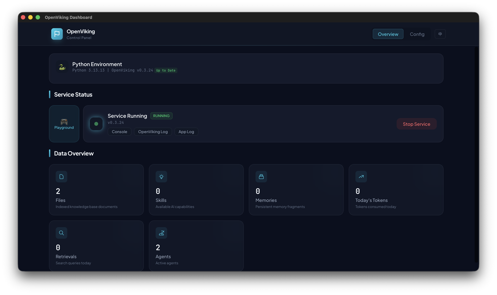
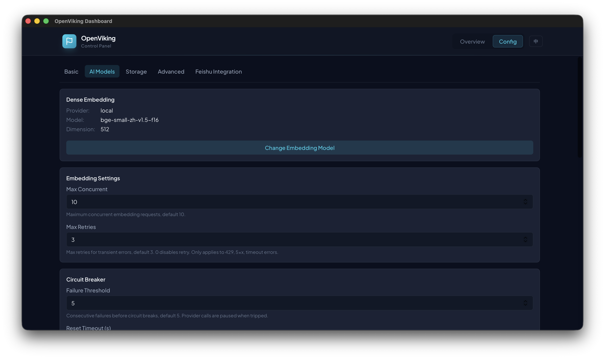

# OpenViking Desktop

A desktop management console for the OpenViking AI knowledge management system, built with **Tauri v2** + **React** + **TypeScript**.





## Features

- **First-run wizard** — Guides you through Python environment setup, working directory selection, AI model configuration, and API Key generation — all through a graphical interface, no command line required
- **Automatic Python environment** — Built-in `uv` runtime automatically downloads the specified Python version, creates a virtual environment, and installs `openviking[bot]`
- **Service management** — One-click start / stop / restart for the OpenViking backend service, system tray support for background operation, automatic crash recovery with up to 3 retries
- **Real-time dashboard** — Displays file count, memory count, token usage, query count and more, auto-refreshing every 10 seconds
- **Configuration management** — Visually configure all parameters across 5 tabs (Basic / AI / Storage / Advanced / Feishu): server, storage, AI models (Embedding / VLM), retrieval settings, Feishu integration, and more
- **Embedded PlayGround** — Open OpenViking PlayGround directly in the app window; API Key is automatically copied to your clipboard
- **System tray** — Minimize to the system tray for background operation
- **Internationalization** — Built-in Chinese and English bilingual UI, automatically follows system language
- **Dark theme** — Carefully crafted dark UI for reduced eye strain

## Tech Stack

| Layer | Technology |
|---|---|
| Desktop Framework | Tauri v2 (Rust) |
| Frontend Framework | React 18 + TypeScript |
| Build Tool | Vite 6 |
| Styling | Tailwind CSS v4 |
| Fonts | Plus Jakarta Sans / JetBrains Mono |
| Internationalization | i18next + react-i18next |
| IPC | @tauri-apps/api (invoke / listen) |
| Backend | Python (OpenViking Service) — automatically installed via uv at runtime |

## Quick Start

```bash
# Install dependencies
pnpm install

# Start dev mode (browser preview, Tauri API unavailable)
pnpm run dev

# Start Tauri desktop app
pnpm tauri dev

# Production build
pnpm run build
pnpm tauri build
```

## Bundling the uv Runtime

Before production build, download the `uv` binary to `resources/uv/` for Tauri to bundle:

```bash
bash scripts/download-uv.sh --platform aarch64-apple-darwin
```

Supported platforms:
- `aarch64-apple-darwin`
- `x86_64-apple-darwin`
- `x86_64-pc-windows-msvc`
- `x86_64-unknown-linux-gnu`

On first launch, the app will automatically use `uv` to download the Python version, create a virtual environment, and install `openviking[bot]` — no manual pre-packaging needed.

## Bundling GGUFs Models

Local Embedding models need to be downloaded to `src-tauri/Resources/models/`:

```bash
bash scripts/download-gguf.sh
```

## Project Structure

```
src/
├── main.tsx                      # React entry
├── App.tsx / App.css             # Root component + Tailwind v4 theme
├── components/
│   ├── dashboard/                # Dashboard module
│   │   ├── Dashboard.tsx         # Main component (state management + polling)
│   │   ├── StatusCard.tsx        # Service status card (5 states)
│   │   ├── StatsGrid.tsx         # Stats grid (4 metric cards)
│   │   └── PythonEnvCard.tsx     # Python environment status card
│   ├── wizard/                   # First-run wizard module
│   │   ├── OnboardingWizard.tsx  # Wizard container (5 steps)
│   │   ├── InstallStep.tsx       # Step 0: Install Python + OpenViking
│   │   ├── WorkspaceStep.tsx     # Step 1: Choose working directory
│   │   ├── EmbeddingStep.tsx     # Step 2: Configure Embedding model
│   │   ├── VlmStep.tsx           # Step 3: Configure VLM model
│   │   ├── ApiKeyStep.tsx        # Step 4: Set Root API Key
│   │   └── WizardProgress.tsx    # Step progress indicator
│   └── config/                   # Config module
│       ├── ConfigPage.tsx        # Config page container
│       ├── ConfigField.tsx       # Reusable config field component
│       ├── ConfigGroup.tsx       # Reusable config group container
│       ├── BasicTab.tsx          # Basic settings
│       ├── AITab.tsx             # AI model settings
│       ├── StorageTab.tsx        # Storage settings
│       ├── AdvancedTab.tsx       # Advanced settings
│       ├── FeishuTab.tsx         # Feishu integration settings
│       └── EmbeddingModal.tsx    # Embedding rebuild modal
├── lib/
│   ├── api.ts                    # REST API wrapper
│   ├── types.ts                  # TypeScript type definitions
│   ├── config-fields.ts          # Declarative config field definitions
│   └── i18n.ts                   # i18n initialization
└── locales/
    ├── zh.json                   # Chinese language pack
    └── en.json                   # English language pack

src-tauri/src/
├── main.rs                       # App entry point
├── lib.rs                        # Tauri commands & plugin registration (~30 commands)
├── process.rs                    # Process management (Python sidecar + health monitoring + auto-restart)
├── python_env.rs                 # uv/Python environment management (download, venv, pip install)
└── tray.rs                       # System tray functionality

scripts/
├── download-uv.sh                # uv binary download script
├── download-gguf.sh              # Local Embedding model download script
└── reset-first-run.sh            # Reset first-run state (for testing)

resources/
└── uv/                           # Platform-specific uv binaries (gitignored)
```

## Development Notes

- The dashboard controls the Python backend process via Tauri `invoke` commands
- After the service is running, data is polled via REST API (`/health`, `/api/v1/console/dashboard/summary`, `/api/v1/stats/memories`)
- The config module uses declarative field definitions (`config-fields.ts`) rendered uniformly by `ConfigField` / `ConfigGroup` components
- Internationalization uses `i18next` with language packs in `src/locales/` (Chinese and English)
- Theme colors: dark background (`surface`), cyan accent (`aurora`), blue accent (`nordic`)
- Working directory structure: `<working-dir>/` contains `ov.conf` (configuration) and `data/` (knowledge base data)
- First run is controlled by the `~/.openviking/.onboarded` flag; delete this file to re-run the wizard
- Build output: macOS DMG (aarch64), see [RELEASE_NOTES.en.md](RELEASE_NOTES.en.md) for release notes

## Branch Strategy

- Do not commit directly to the `main` branch. All development should be done on feature branches and merged via Pull Request.
- See [AGENTS.md](AGENTS.md) for detailed development guidelines.
