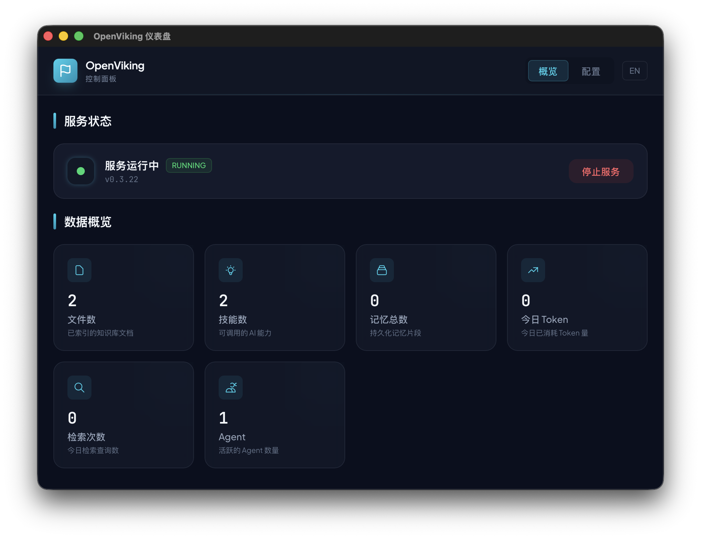
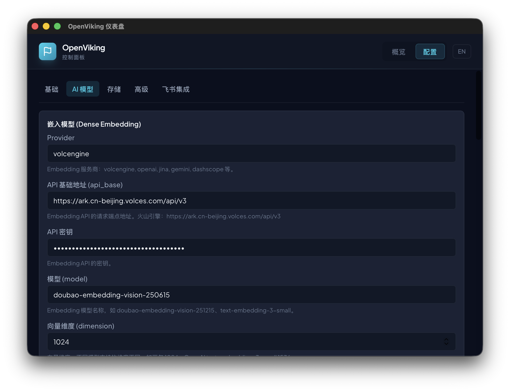

# OpenViking Desktop

OpenViking 的桌面管理控制台，基于 **Tauri v2** + **React** + **TypeScript** 构建，提供对 OpenViking AI 知识管理系统的本地监控与管理能力。





## 功能特性

- **服务管理** — 一键启动 / 停止 OpenViking 后端服务，实时监控运行状态
- **数据概览** — 直观展示文件数、技能数、记忆总数、今日 Token 消耗等关键指标
- **配置管理** — 支持服务器、存储、AI 模型（Embedding / LLM / VLM）、检索参数、飞书集成等全方位配置
- **实时监控** — 通过 Tauri IPC 监听服务状态变化，每 10 秒自动刷新仪表盘数据
- **系统托盘** — 支持最小化到系统托盘运行，后台常驻管理
- **国际化** — 内置中英文双语界面支持

## 技术栈

| 层级 | 技术 |
|---|---|
| 桌面框架 | Tauri v2 (Rust) |
| 前端框架 | React 18 + TypeScript |
| 构建工具 | Vite 6 |
| 样式方案 | Tailwind CSS v4 |
| 字体 | Plus Jakarta Sans / JetBrains Mono |
| 国际化 | i18next + react-i18next |
| IPC | @tauri-apps/api (invoke / listen) |
| 后端 | Python sidecar (OpenViking Service) |

## 快速开始

```bash
# 安装依赖
pnpm install

# 启动开发模式（浏览器预览，Tauri API 不可用）
pnpm run dev

# 启动 Tauri 桌面应用
pnpm tauri dev

# 生产构建
pnpm run build
pnpm tauri build
```

## 打包 Python 运行时

生产构建前，需要将 Python 运行时与 OpenViking 依赖打包到 `resources/python` 目录，供 Tauri sidecar 使用：

```bash
bash scripts/bundle-python.sh
```

该脚本会：
1. 使用 `uv` 创建一个全新的 Python 3.12 虚拟环境
2. 在虚拟环境中安装 `openviking` 及其所有依赖
3. 清理 `__pycache__`、`.pyc`、`.pyo` 等缓存文件以减小体积
4. 将打包后的环境输出到 `resources/python/` 目录

## 项目结构

```
src/
├── main.tsx                      # React 入口
├── App.tsx / App.css             # 根组件 + Tailwind v4 主题
├── components/
│   ├── dashboard/                # 仪表盘模块
│   │   ├── Dashboard.tsx         # 主组件（状态管理 + 数据轮询）
│   │   ├── StatusCard.tsx        # 服务状态卡片（5 种状态）
│   │   └── StatsGrid.tsx         # 统计数据网格（4 指标卡片）
│   └── config/                   # 配置模块
│       ├── ConfigPage.tsx        # 配置页容器
│       ├── ConfigField.tsx       # 可复用配置字段组件
│       ├── ConfigGroup.tsx       # 可复用配置分组容器
│       ├── BasicTab.tsx          # 基础配置
│       ├── AITab.tsx             # AI 模型配置
│       ├── StorageTab.tsx        # 存储配置
│       ├── FeishuTab.tsx         # 飞书集成配置
│       └── AdvancedTab.tsx       # 高级配置
├── lib/
│   ├── api.ts                    # REST API 封装
│   ├── types.ts                  # TypeScript 类型定义
│   ├── config-fields.ts          # 配置字段定义
│   └── i18n.ts                   # i18n 国际化初始化
└── locales/
    ├── zh.json                   # 中文语言包
    └── en.json                   # 英文语言包

src-tauri/src/
├── main.rs                       # 应用入口
├── lib.rs                        # Tauri 命令与插件注册
├── process.rs                    # 子进程管理（Python sidecar）
└── tray.rs                       # 系统托盘功能

scripts/
└── bundle-python.sh              # Python 虚拟环境打包脚本

resources/
└── python/                       # 打包后的 Python 运行时（gitignored）
```

## 开发说明

- 仪表盘通过 Tauri `invoke` 命令控制 Python 后端进程
- 服务运行后通过 REST API（`/health`、`/api/v1/console/dashboard/summary`、`/api/v1/stats/memories`）轮询数据
- 配置模块使用声明式字段定义（`config-fields.ts`），通过 `ConfigField` / `ConfigGroup` 组件统一渲染
- 国际化使用 `i18next`，语言包位于 `src/locales/`，当前支持中文和英文
- 主题色系：深色背景（`surface`）+ 青蓝点缀（`aurora`）+ 辅助蓝（`nordic`）
